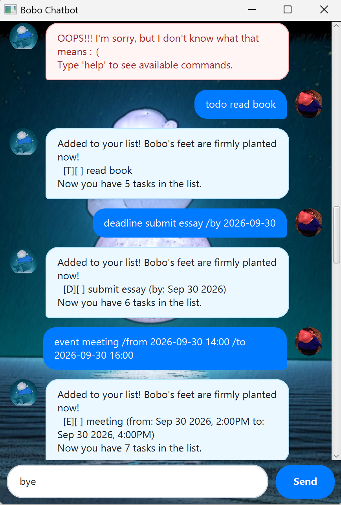

# Bobo - User Guide

Bobo is a lightweight, interactive desktop task management chatbot that helps you organize your daily tasks, deadlines, and events with an evolving dynamic personality!



---

## Quick Start

1. **Prerequisites**: Ensure you have **Java 17** or higher installed on your computer.
2. **Download / Clone**: Open a terminal in the project directory.
3. **Launch the Application**:
   - On Windows: Run `.\gradlew.bat run`
   - On macOS/Linux: Run `./gradlew run`
4. **Interact**: Type any command into the text box at the bottom of the window and press **Enter** (or click **Send**).

---

## Dynamic Bobo Personality

Bobo isn't just an ordinary task tracker—Bobo has a **dynamic personality** that evolves based on the number of items stored in your task list!

As your task list grows, Bobo transforms across 5 distinct size categories:

- **Stage 1 (0–4 tasks)**: Extremely tiny, nervous, squeaky Bobo.
  - *Example Greeting*: `*squeak!* Eep! Hi there... I-I'm tiny Bobo... please don't step on me!`
- **Stage 2 (5–8 tasks)**: Small but more confident Bobo.
  - *Example Greeting*: `Hello hello! Bobo is growing a tiny bit bigger and feeling steady!`
- **Stage 3 (9–12 tasks)**: Average-sized, energetic Bobo.
  - *Example Greeting*: `Hey there! Bobo here, bursting with energy and ready to crush to-dos!`
- **Stage 4 (13–16 tasks)**: Large, booming, confident Bobo.
  - *Example Greeting*: `**GREETINGS MORTAL!** BOBO HAS GROWN LARGE AND FULL OF POWER!`
- **Stage 5 (17+ tasks)**: Giant Titan Bobo with dramatic, powerful wording.
  - *Example Greeting*: `**BEHOLD THE MIGHTY TITAN BOBO! SHAKER OF WORLDS, COMMANDER OF TASKS!**`

Bobo's personality recalculates dynamically whenever you add, delete, or load tasks on startup!

---

## Date and Time Formats

Bobo supports flexible date and time inputs for deadlines and events.

### Supported Date Formats
- `yyyy-MM-dd` (e.g., `2026-09-30`)
- `d/M/yyyy` (e.g., `30/9/2026`)
- `yyyy/MM/dd` (e.g., `2026/09/30`)

### Supported Time Formats (Optional)
Append a time after the date string using:
- `HH:mm` (e.g., `14:00`)
- `HHmm` (e.g., `1400`)

*Example*: `2026-09-30 14:00` or `30/9/2026 1400`.

---

## Automatic File Persistence

- All task modifications are automatically saved to `store.txt` in your application directory.
- When you re-launch Bobo, your tasks and Bobo's personality stage are restored automatically!

---

## Command Summary

- **Add Todo**: `todo <description>`
- **Add Deadline**: `deadline <description> /by <date_or_datetime>`
- **Add Event**: `event <description> /from <start> /to <end>`
- **List Tasks**: `list`
- **Mark Task Done**: `mark <task_number>`
- **Unmark Task**: `unmark <task_number>`
- **Delete Task**: `delete <task_number>`
- **Find Tasks**: `find <keyword>`
- **Filter Tasks on Date**: `on <date>`
- **Help Guide**: `help`
- **Exit Application**: `bye`

---

## Features & Usage

### 1. Adding Tasks

#### Todo Task
Creates a simple task without any date or time constraint.
- **Syntax**: `todo <description>`
- **Valid Example**: `todo read textbook`

#### Deadline Task
Creates a task with a target completion deadline.
- **Syntax**: `deadline <description> /by <date_or_datetime>`
- **Valid Example**: `deadline submit essay /by 2026-09-30 14:00`

#### Event Task
Creates an event task with a start time and end time.
- **Syntax**: `event <description> /from <start_date_or_datetime> /to <end_date_or_datetime>`
- **Valid Example**: `event team meeting /from 2026-09-30 14:00 /to 2026-09-30 16:00`

---

### 2. Viewing Tasks

#### List All Tasks
Displays all currently saved tasks with their completion status and indices.
- **Syntax**: `list`
- **Example Output**:
  ```text
  Here are the tasks in your list:
  1.[T][ ] read textbook
  2.[D][X] submit essay (by: Sep 30 2026, 2:00PM)
  ```

---

### 3. Managing Task Status

#### Mark Task as Done
Marks a task as completed (indicated by `[X]`).
- **Syntax**: `mark <task_number>`
- **Valid Example**: `mark 1`

#### Unmark Task as Undone
Reverts a completed task back to incomplete (indicated by `[ ]`).
- **Syntax**: `unmark <task_number>`
- **Valid Example**: `unmark 1`

---

### 4. Deleting Tasks

#### Delete a Task
Removes a task permanently from your list by its 1-based index number.
- **Syntax**: `delete <task_number>`
- **Valid Example**: `delete 2`

---

### 5. Searching & Filtering Tasks

#### Find Tasks by Keyword
Searches for all tasks containing the specified keyword in their description.
- **Syntax**: `find <keyword>`
- **Valid Example**: `find essay`

#### Filter Tasks Occurring on a Date
Displays all deadlines and events taking place on the specified target date.
- **Syntax**: `on <date>`
- **Valid Example**: `on 2026-09-30`

---

### 6. Utility Commands

#### Display Help
Displays a quick reference guide of available commands, formats, and examples in the chat pane.
- **Syntax**: `help`

#### Exit Application
Closes the Bobo application window gracefully.
- **Syntax**: `bye`

---

## Error Handling & Error Messages

If you type an unrecognized command or omit required parameters, Bobo presents an **Error Box** (styled with a distinct red background) to catch your attention and explain how to fix the issue.

### Examples of Error Messages

- **Empty Description**:
  - *Input*: `todo`
  - *Error Box*: `OOPS!!! The description of a todo cannot be empty.`
- **Missing Deadline Date**:
  - *Input*: `deadline submit essay`
  - *Error Box*: `OOPS!!! The deadline of a deadline cannot be empty.`
- **Invalid Task Number**:
  - *Input*: `mark abc`
  - *Error Box*: `Error: Invalid task number!`
- **Unrecognized Command**:
  - *Input*: `foobar`
  - *Error Box*: `OOPS!!! I'm sorry, but I don't know what that means :-(\nType 'help' to see available commands.`